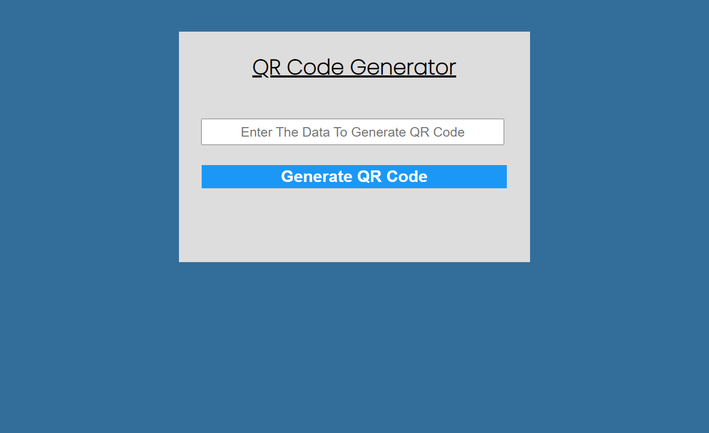
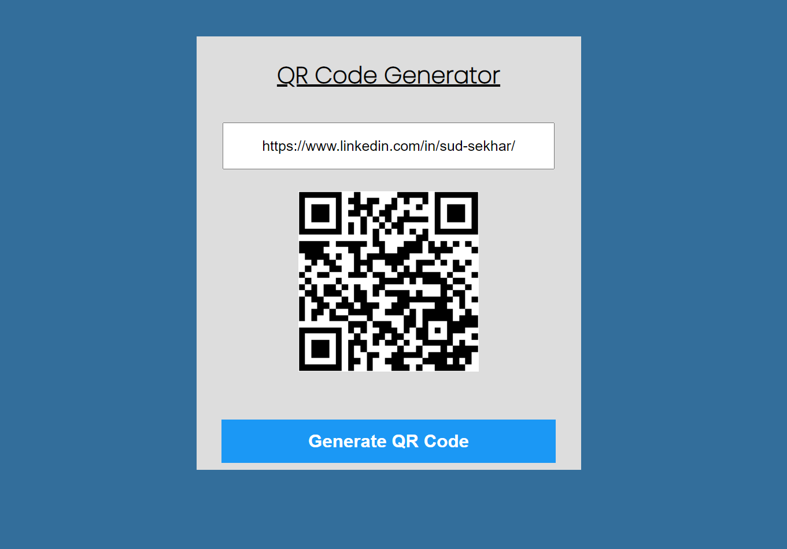

## Hi, I'm Sudhansu Sekhar Mahankuda ! 👋

### 🚀 I'm a front-end developer...

# QR Code Generator

- This is a Qr code generator app, In this app in the input field you have to write what you want to show in the qr code. After clicking the generate button will create a qr code. 

---

- It took me around  1 hour to make this project .

## 🛠 Skills
HTML, CSS, JavaScript

[LinkedIn](https://www.linkedin.com/in/sud-sekhar/)

[Netlify](https://qr-code-generator-sud.netlify.app/)

